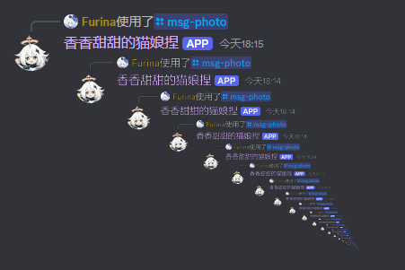
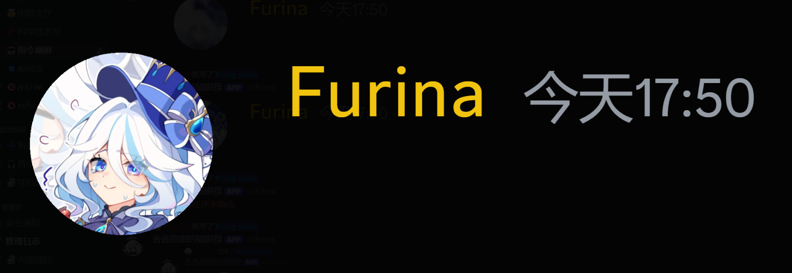
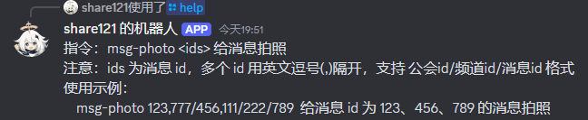
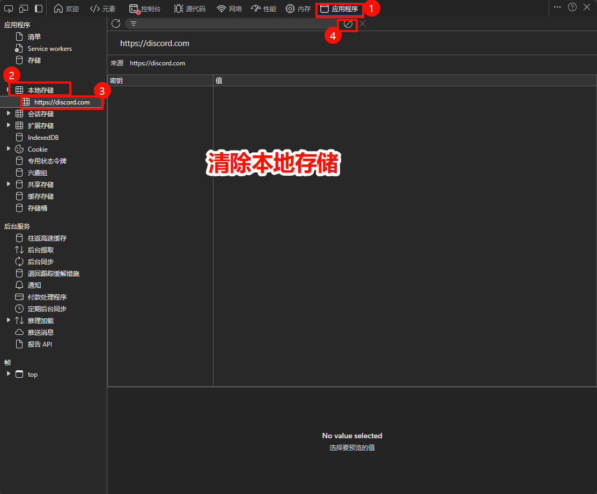
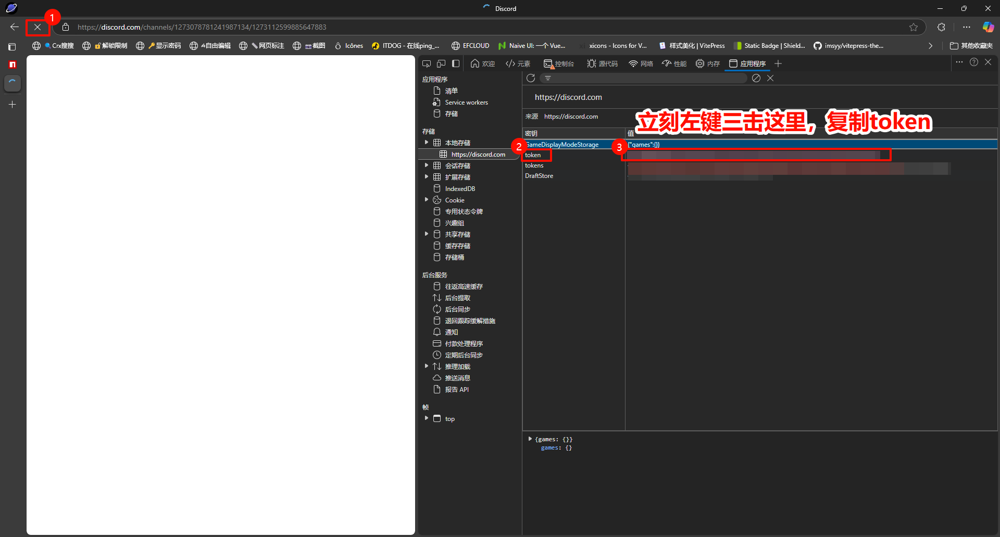
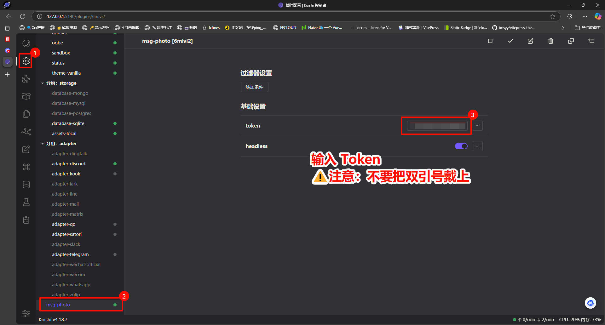

# Msg-Photo 消息截图

给 Discord 消息截图

1. 支持跨服务器、跨频道截图
2. 支持一次性截多个消息
3. 高清截图
4. 可配置

### 嵌套截图

### 高清截图

### 帮助

### 已知问题

1. 无法获取 NSFW 频道中的消息

### 安装

1. 在插件市场搜索 `msg-photo` 并安装
2. 打开网页版的 [Discord](https://discord.com/)，登录你的账号
3. `Ctrl` + `Shift` + `I` 打开开发者工具，切换到 `Applications` 标签页，找到 `Local Storage`，然后清除数据
   
4. 复制 Token
   
5. 输入 Token，⚠️ 注意：不要把双引号带上
   
